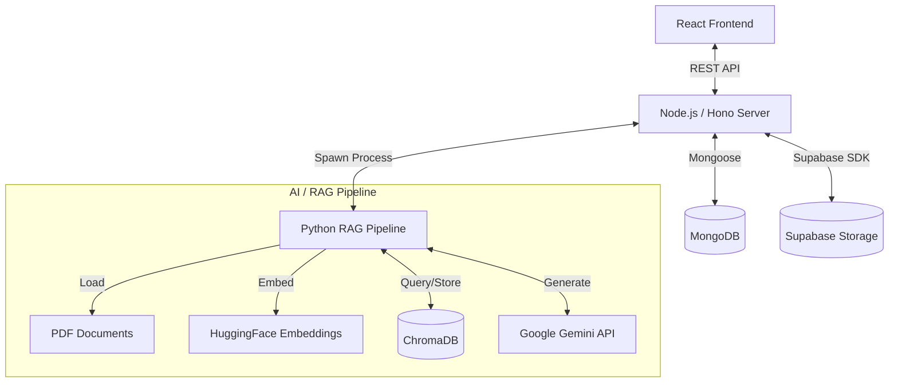

# PolicyPilot Technical Overview

This document provides a comprehensive technical analysis of the PolicyPilot codebase. It details the technology stack, system architecture, database schemas, API endpoints, and the AI/RAG pipeline implementation.

## 1. Technology Stack

### Frontend
- **Framework**: React 18 (via Vite)
- **Language**: TypeScript
- **Styling**: Tailwind CSS, Vanilla CSS
- **UI Components**: Radix UI (primitives), Lucide React (icons)
- **State/Routing**: React Router (implied by file structure), React Hooks

### Backend
- **Runtime**: Node.js
- **Framework**: Hono (lightweight web framework)
- **Adapter**: `@hono/node-server` for running on Node.js
- **Language**: TypeScript
- **Database ORM**: Mongoose (for MongoDB)
- **Storage/Auth**: Supabase (Client library used for storage buckets)

### AI & RAG Pipeline
- **Language**: Python 3.x
- **Orchestration**: LangChain
- **LLM**: Google Gemini (`gemini-2.5-pro`, `gemini-2.5-flash`) via `google-generativeai`
- **Vector Store**: ChromaDB (local persistence)
- **Embeddings**: HuggingFace (`all-MiniLM-L6-v2`) via `langchain-huggingface`
- **PDF Processing**: `pypdf`, `langchain-community` loaders

### Infrastructure
- **Database**: MongoDB (Metadata), Supabase (File Storage)
- **Deployment**: Vercel (implied by `vercel.json`)

## 2. System Architecture

PolicyPilot employs a hybrid architecture where a Node.js/Hono server handles API requests and orchestrates a separate Python process for heavy AI/RAG tasks.

### Data Flow
1.  **Upload**: User uploads denial/policy PDFs via Frontend.
2.  **Storage**: Files are stored in Supabase Storage (or MongoDB Buffers as fallback). Metadata is saved to MongoDB.
3.  **Ingestion**: Server spawns `pipeline.py --mode ingest`. Python script downloads files, chunks text, generates embeddings, and stores them in a local ChromaDB instance (`chroma_db_{case_id}`).
4.  **Analysis**: Server spawns `pipeline.py --mode analysis`. Script retrieves relevant chunks from ChromaDB and prompts Gemini to analyze the denial.
5.  **Drafting**: Server spawns `pipeline.py --mode email_draft`. Script retrieves policy details and generates an appeal email using Gemini.

## 3. Database Schema (MongoDB)

The application uses MongoDB with Mongoose schemas.

### User Collection (`users`)
Stores user profile and compliance status.
- `email` (String, unique): User's email address.
- `password` (String, optional): Hashed password (if not using OAuth).
- `firstName`, `lastName` (String): User details.
- `hipaaAccepted` (Boolean): HIPAA compliance consent.
- `termsAccepted` (Boolean): Terms of service consent.
- `createdAt` (String): ISO timestamp.

### InsurancePlan Collection (`insuranceplans`)
Stores policy details and associated documents.
- `id` (String, unique): Plan UUID.
- `userId` (String): Reference to User.
- `insuranceCompany` (String): Name of insurer.
- `planName` (String): Name of the plan.
- `policyNumber` (String): Policy ID.
- `policyType` (Enum): `comprehensive` | `supplementary`.
- `policyFiles` (Array): List of file metadata objects (name, path, bucket).
- `coveredIndividuals` (Array): List of dependents/beneficiaries.

### Case Collection (`cases`)
The central entity tracking an appeal process.
- `id` (String, unique): Case UUID.
- `userId` (String): Reference to User.
- `planId` (String): Reference to InsurancePlan.
- `status` (Enum): `uploading`, `analyzing`, `ready-to-send`, `sent`, `awaiting-reply`, `reply-received`.
- `denialFiles` (Array): List of file metadata objects.
- `parsedData` (Object): Extracted metadata (insurer, policyNumber, denialReason).
- `analysis` (Object): AI-generated analysis.
    - `analysis` (String): Full text analysis.
    - `terms` (Array): Defined legal/insurance terms.
    - `weaknesses` (Array): Identified weaknesses in the denial.
- `emailDraft` (Object): Generated appeal email (subject, body).
- `emailThread` (Array): History of sent/received emails.

## 4. API Endpoints

All endpoints are prefixed with `/api`.

### Case Management (`/api/cases`)
- `GET /` - List all cases for a user.
- `GET /:id` - Get details of a specific case.
- `POST /` - Create a new case.
- `PUT /:id` - Update case details.
- `DELETE /:id` - Delete a case and its files.
- `POST /:id/files` - Upload denial files (triggers ingestion).
- `POST /:id/analyze` - Trigger AI analysis of the denial.
- `POST /:id/email` - Generate an appeal email draft.
- `POST /:id/denial-extract` - Extract brief denial reason from files.

### Gmail Integration (`/api/gmail`)
- `GET /auth` - Initiate Google OAuth flow.
- `GET /callback` - Handle OAuth callback.
- `GET /login` - Check login status.
- `POST /send` - Send an email via Gmail API.
- `POST /sync` - Sync email threads.
- `POST /webhook` - Handle Gmail push notifications.

### Other Routes
- `/api/users` - User management.
- `/api/plans` - Insurance plan management.
- `/api/files` - General file handling.

## 5. RAG Pipeline Implementation

The core intelligence resides in `src/rag/pipeline.py`. It is a CLI tool invoked by the Node.js server.

### Modes
1.  **Ingest (`--mode ingest`)**:
    -   Connects to MongoDB to fetch file metadata.
    -   Downloads PDFs from Supabase Storage.
    -   Uses `RecursiveCharacterTextSplitter` (chunk size: 2000, overlap: 600).
    -   Generates embeddings using `all-MiniLM-L6-v2`.
    -   Persists vector index to `chroma_db_{case_id}`.

2.  **Extraction (`--mode extraction`)**:
    -   Loads PDFs and creates a temporary vector store.
    -   Queries for "insurance company name plan name policy number".
    -   Uses `gemini-2.5-pro` to extract structured JSON data.

3.  **Denial Extraction (`--mode denial_extract`)**:
    -   Similar to extraction but focuses on "denial reason".
    -   Generates a 1-sentence description of the denial.

4.  **Analysis (`--mode analysis`)**:
    -   Loads the case's ChromaDB store.
    -   Performs similarity search for "denial reason policy coverage exclusions".
    -   Constructs a prompt with retrieved context.
    -   Uses `gemini-2.5-flash` to generate a layman's explanation and define terms.

5.  **Email Draft (`--mode email_draft`)**:
    -   Retrieves policy context and previous analysis.
    -   Fetches email thread history from MongoDB.
    -   Uses `gemini-2.5-pro` with a "Health Insurance Denial Lawyer" persona.
    -   Generates a professional appeal email body.

### Integration Details
- **Environment Variables**: The Node.js server passes `MONGODB_URI`, `GEMINI_API_KEY`, and Supabase credentials to the Python process environment.
- **Error Handling**: The server captures `stderr` from the Python process and parses the last line of `stdout` as JSON to get the result.

## 6. External Integrations

### Google Gmail API
- Used for sending appeals and tracking correspondence.
- Implements OAuth2 for user authentication.
- Supports watching for new emails via webhooks (Pub/Sub).

### Google Generative AI (Gemini)
- **Models**: `gemini-2.5-pro` (complex tasks like extraction/drafting), `gemini-2.5-flash` (faster analysis).
- **Usage**: Zero-shot and few-shot prompting for extraction, analysis, and content generation.

### Supabase
- **Storage**: Used as the primary object store for PDF documents.
- **Buckets**: `denials` and `policies`.
